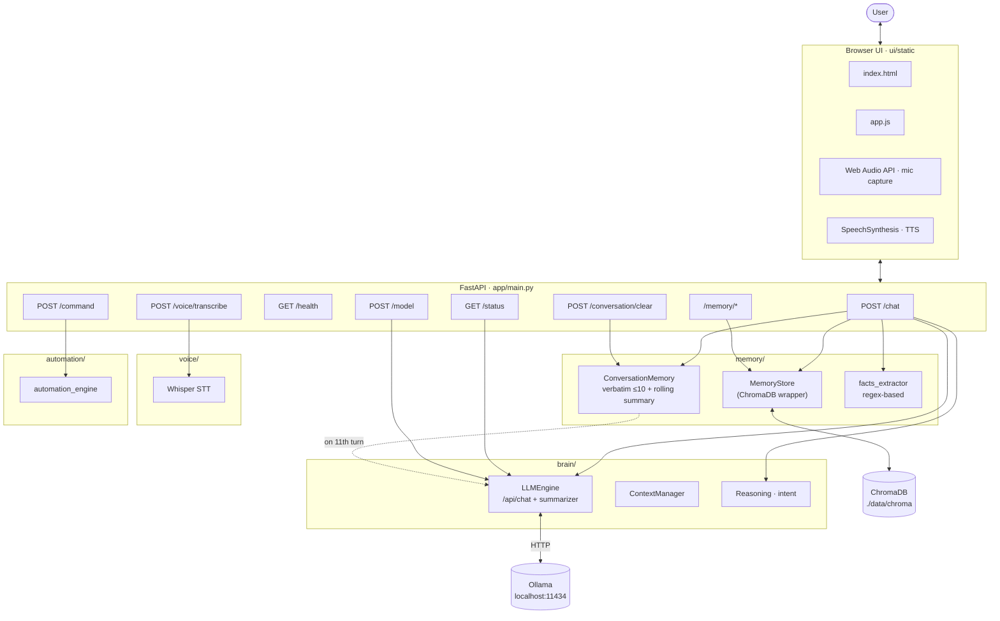
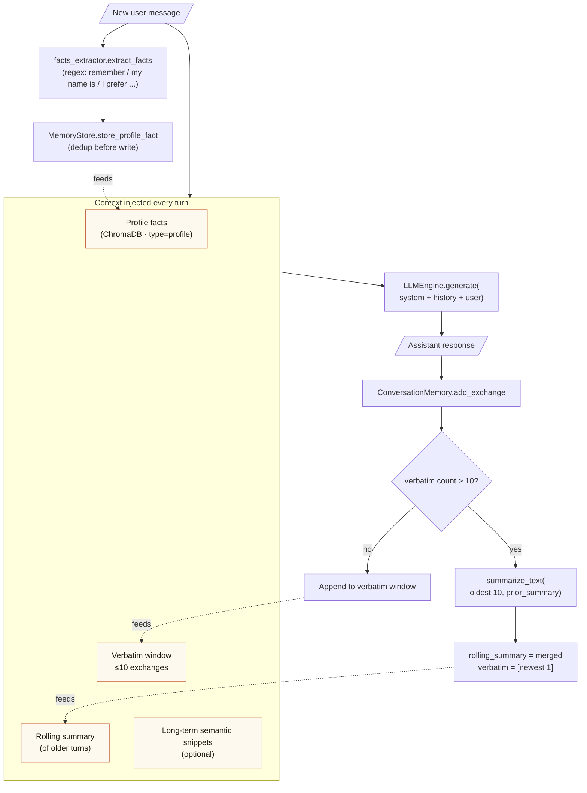
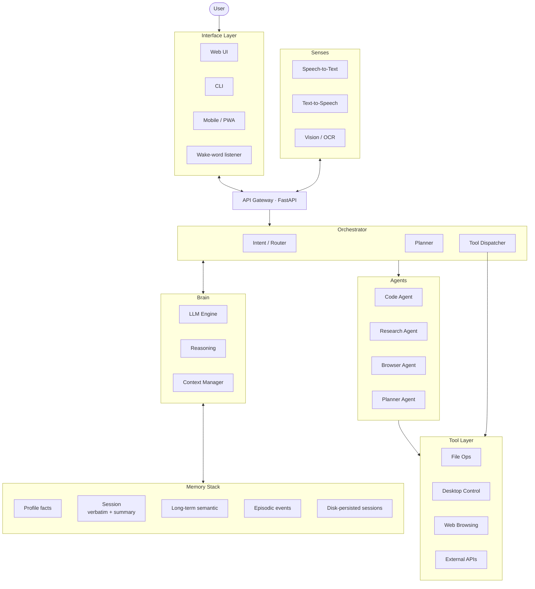

# Jarvis Architecture & Design

## System Architecture

```
┌─────────────────────────────────────────────────────────┐
│                    USER INTERFACE                        │
│         (CLI / Web / Voice / Mobile)                     │
└────────────────────┬────────────────────────────────────┘
                     │
        ┌────────────▼────────────┐
        │   INPUT PROCESSING      │
        ├─────────────────────────┤
        │ • Voice Recognition     │
        │ • Text Parsing          │
        │ • Intent Detection      │
        │ • Command Routing       │
        └────────────┬────────────┘
                     │
         ┌───────────▼──────────────┐
         │   MAIN BRAIN (LLM)       │
         ├──────────────────────────┤
         │ DeepSeek / Llama / etc   │
         │ Context Window           │
         │ Reasoning Engine         │
         │ Decision Making          │
         └───────────┬──────────────┘
                     │
     ┌───────────────┼───────────────┐
     │               │               │
     ▼               ▼               ▼
┌──────────┐  ┌──────────┐  ┌──────────┐
│MEMORY    │  │AGENTS    │  │PLANNER   │
│SYSTEM    │  │MANAGER   │  │SYSTEM    │
├──────────┤  ├──────────┤  ├──────────┤
│ChromaDB  │  │Multi-AI  │  │Goal      │
│Vectors   │  │Task Ops  │  │Decompose │
│Semantic  │  │Routing   │  │Exec Plan │
└─────┬────┘  └────┬─────┘  └────┬─────┘
      │            │             │
      └────────────┼─────────────┘
                   │
        ┌──────────▼──────────┐
        │  EXECUTION LAYER    │
        ├─────────────────────┤
        │ • Automation        │
        │ • Browser Control   │
        │ • File Operations   │
        │ • API Calls         │
        └────────────┬────────┘
                     │
        ┌────────────▼────────────┐
        │   OUTPUT PROCESSING     │
        ├─────────────────────────┤
        │ • Response Building     │
        │ • Text-to-Speech        │
        │ • UI Rendering          │
        │ • Result Formatting     │
        └────────────┬────────────┘
                     │
        ┌────────────▼────────────┐
        │   OUTPUT DELIVERY       │
        │ (Voice/Text/UI)         │
        └─────────────────────────┘
```

> The ASCII above is the **aspirational** big-picture view. The Mermaid diagrams
> below reflect what the codebase actually does today, plus a planned target.

### Current Architecture (as built)



### /chat Request Lifecycle

```mermaid
sequenceDiagram
  autonumber
  participant User
  participant UI as Browser UI
  participant API as FastAPI /chat
  participant Store as MemoryStore
  participant Conv as ConversationMemory
  participant Facts as facts_extractor
  participant LLM as LLMEngine
  participant Ollama as Ollama HTTP

  User->>UI: Type / hold space to speak
  UI->>API: POST /chat { message, voice_mode, include_context }

  Note over API,Conv: Build context from three labeled channels
  API->>Store: get_profile_facts()
  API->>Conv: get_running_summary()
  API->>Store: get_context(message)  [semantic]
  API->>Conv: get_session_messages(10)  [verbatim]

  API->>LLM: generate(prompt, context, history, voice_mode)
  LLM->>Ollama: POST /api/chat (system + history + user)
  Ollama-->>LLM: response text
  LLM-->>API: cleaned response

  Note over API,Conv: Persist + housekeeping
  API->>Conv: add_exchange(user, response)
  alt verbatim buffer > 10 exchanges
    Conv->>LLM: summarize_text(oldest 10, prior_summary)
    LLM->>Ollama: POST /api/chat (summarizer prompt)
    Ollama-->>LLM: brief faithful summary
    LLM-->>Conv: merged rolling summary
    Conv->>Conv: rolling_summary = merged; verbatim = newest 1
  end
  API->>Facts: extract_facts(message)
  Facts-->>API: profile fact strings
  API->>Store: store_profile_fact(...)

  API-->>UI: { response, intent }
  UI->>User: Render bubble + TTS
```

### Memory Pipeline (rolling summary + profile facts)



### Target Architecture (planned)



## Module Breakdown

### 1. Brain Module (`brain/`)
- **llm_engine.py**: Ollama integration, model management
- **context_manager.py**: Session state, conversation history
- **reasoning.py**: Intent analysis, decision making

### 2. Memory Module (`memory/`)
- **memory_store.py**: ChromaDB vector database
- **conversation_memory.py**: Dialogue history
- **project_memory.py**: Project context

### 3. Voice Module (`voice/`)
- **speech_to_text.py**: Whisper integration
- **text_to_speech.py**: Piper integration
- **wake_word.py**: Wake word detection

### 4. Automation Module (`automation/`)
- **desktop_control.py**: PyAutoGUI for OS control
- **browser_control.py**: Playwright for web automation
- **file_manager.py**: File operations

### 5. Vision Module (`vision/`)
- **ocr.py**: Tesseract/EasyOCR integration
- **screen_analysis.py**: OpenCV for UI detection
- **webcam.py**: Real-time camera input

### 6. Agents Module (`agents/`)
- **coding_agent.py**: VS Code integration, code generation
- **browser_agent.py**: Web research, scraping
- **research_agent.py**: Internet search
- **planner_agent.py**: Long-term task planning

### 7. API Module (`api/`)
- **main.py**: FastAPI routes
- **routes.py**: Endpoint definitions
- **models.py**: Request/response schemas

### 8. UI Module (`ui/`)
- **frontend/**: React/Vue frontend
- **desktop/**: Electron desktop app
- **mobile/**: React Native (future)

## Data Flow

### User Input Flow
```
Voice/Text Input
    ↓
Speech Processing (STT if voice)
    ↓
Intent Analysis
    ↓
Context Retrieval from Memory
    ↓
LLM Reasoning
    ↓
Action Decision
    ↓
Execute (if needed)
    ↓
Generate Response
    ↓
Output (TTS/UI)
```

### Memory Flow
```
New Information
    ↓
Embedding Generation
    ↓
ChromaDB Storage
    ↓
Semantic Indexing
    ↓
Fast Retrieval (on similarity)
```

## Technology Stack

### LLM & AI
- **Ollama**: Local LLM runtime
- **LangChain**: AI orchestration
- **DeepSeek/Llama**: Model options

### Voice
- **Whisper**: Speech recognition
- **Piper**: Text-to-speech
- **Faster-Whisper**: Optimized STT

### Memory
- **ChromaDB**: Vector database
- **Sentence-Transformers**: Embeddings
- **SQLite**: Structured data

### Automation
- **PyAutoGUI**: Desktop control
- **Playwright**: Browser automation
- **Keyboard**: Low-level input

### Vision
- **OpenCV**: Computer vision
- **Tesseract**: OCR
- **YOLO**: Object detection (future)

### Backend
- **FastAPI**: REST API
- **Uvicorn**: ASGI server
- **SQLAlchemy**: ORM

### Frontend
- **React**: Web UI (future)
- **Electron**: Desktop app (future)

## Design Patterns

### 1. Singleton Pattern
Global instances for core components:
```python
def get_llm_engine():
    global _llm_engine
    if _llm_engine is None:
        _llm_engine = LLMEngine()
    return _llm_engine
```

### 2. Observer Pattern
Event-driven architecture for automation

### 3. Strategy Pattern
Different agents for different tasks

### 4. Pipeline Pattern
Input → Processing → Output flow

## Performance Considerations

### Memory Optimization
- Local models (no API latency)
- Vector database for fast recall
- Context window management

### Speed Optimization
- Model quantization (GGML)
- Cached embeddings
- Parallel agent execution

### Resource Management
- CPU/GPU auto-selection
- Memory pooling
- Connection caching

## Security Architecture

### Local-First Design
- All processing local (no cloud)
- No data transmission
- Privacy by default

### Access Control
- Authentication for API
- Local file permissions
- Secure credential storage

## Scalability

### Horizontal Scaling
- API load balancing
- Distributed agents
- Cloud memory backend (optional)

### Vertical Scaling
- GPU support
- Larger models
- More agents

## Extension Points

### Add New Agents
```python
class CustomAgent(BaseAgent):
    def execute(self, task):
        # Your logic here
        pass
```

### Add New Commands
```python
@app.post("/command/custom")
async def custom_command(request):
    # Your endpoint
    pass
```

### Add New Tools
```python
class CustomTool:
    def execute(self):
        pass
```

## What's Next

Concrete, prioritized work items. Each is scoped to one or two focused PRs.
Tags: **Impact** (how much the user notices) · **Effort** (rough days of work).

| # | Item | Impact | Effort | Why |
|---|---|---|---|---|
| 1 | **Tool calling on /chat** | High | M (2–3 d) | Hook intent → real actions (file ops, open app, browser). Right now the model refuses requests like "create a file" because the chat path never calls automation_engine. |
| 2 | **Streaming responses (SSE)** | High | S (1 d) | Switch Ollama to `stream=true`, push chunks via Server-Sent Events. Replies appear word-by-word like ChatGPT — feels 5× faster. |
| 3 | **Persist sessions to disk** | High | S (½ d) | JSON-serialize `current_session + rolling_summary` after each turn; auto-load on startup. Server restart no longer wipes the thread. |
| 4 | **Memory inspection panel in UI** | Med | S (1 d) | Sidebar showing all profile facts (delete button each) + current rolling summary preview. Lets the user audit and correct what Jarvis "knows." |
| 5 | **Multi-session sidebar (ChatGPT-style)** | Med | M (2 d) | List of past sessions auto-titled from first user message; click to resume. Backend endpoints + left panel UI. Builds on #3. |
| 6 | **Wake word — "Hey Jarvis"** | Med | M (2 d) | openWakeWord or Porcupine + an always-listening pipeline. Makes the voice button optional. |
| 7 | **Drag-drop image → OCR + describe** | Med | S (1 d) | Wire EasyOCR. Composer accepts images; extracted text fed into the chat as a "user attached" message. |
| 8 | **Tighten STT — pick correct mic by name** | Med | S (½ d) | Today the browser uses the OS default. Add a device-picker in settings and persist the choice. Fixes the "0% level meter on wrong mic" class of bugs. |
| 9 | **Research agent (real, not snippet-fetch)** | High | L (3–5 d) | Loop: pick queries → fetch top N pages → extract → summarize → cite. Replaces the current single DuckDuckGo regex scrape. |
| 10 | **Plugin / skill system** | Med | L (4–6 d) | Drop-in `skills/<name>.py` files that register an intent + handler. Foundation for community extensions. |

**My pick for the next ship:** items **#2 + #3 + #4 in one push.** They're each small, they compose into a noticeably more "real" assistant (streams, survives restart, shows what it remembers), and #4 makes the memory work you just paid for actually visible.

After that, **#1 (tool calling)** is the unlock that turns Jarvis from a chat box into an actual assistant — it's where every "I can't do that" response today becomes a real action.
